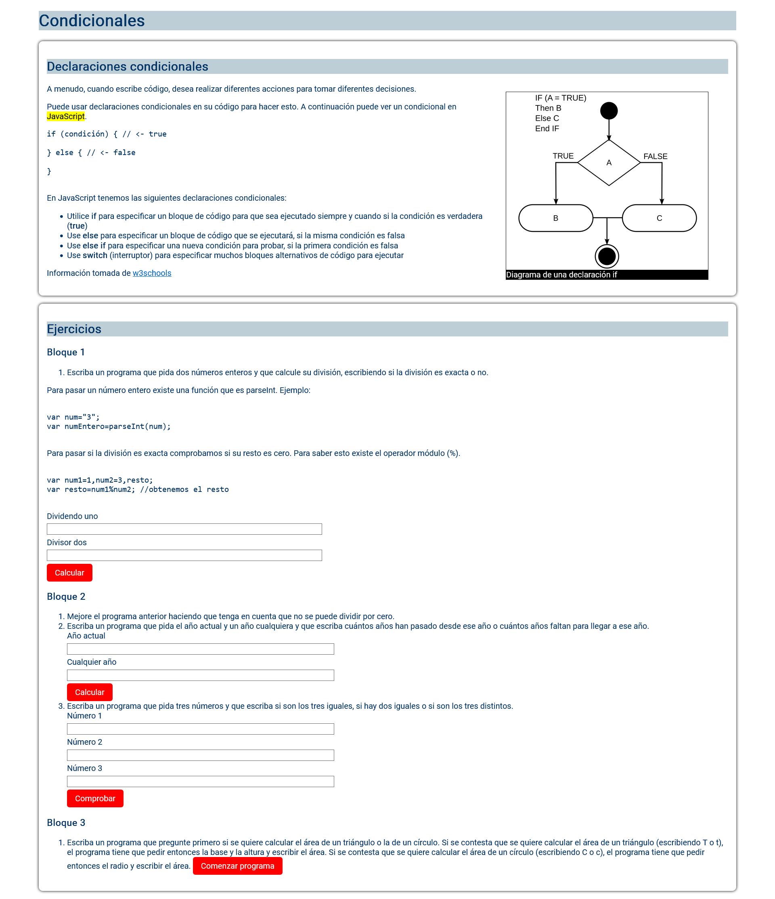

# Ejercicio básico de estructuras condicionales

>[!NOTE]
>Descarga o clona este repositorio y realiza las instrucciones del fichero __index.html__

>[!NOTE]
>Al final de este ejercicio tendrás que comprender los siguientes conceptos:

## Propiedades y métodos

- if, else
- parseInt(). Esta función convierte un **string** a **number** entero
- Operador módulo: **%**
- document.querySelector(). Para seleccionar elementos del **Document Object Model**
- elemento.addEventListener(evento, referenciaAFuncion)
  - evento.preventDefault()
  - click

## Funciones

### isNaN()

Comprueba is un valor **NO ES UN NÚMERO**

### typeof

Devuelve como **string** el tipo de dato de una variable o literal

### parseInt

Convierte un valor numérico a entero

### Number()

Convierte si puede cualquier valor a **number**
